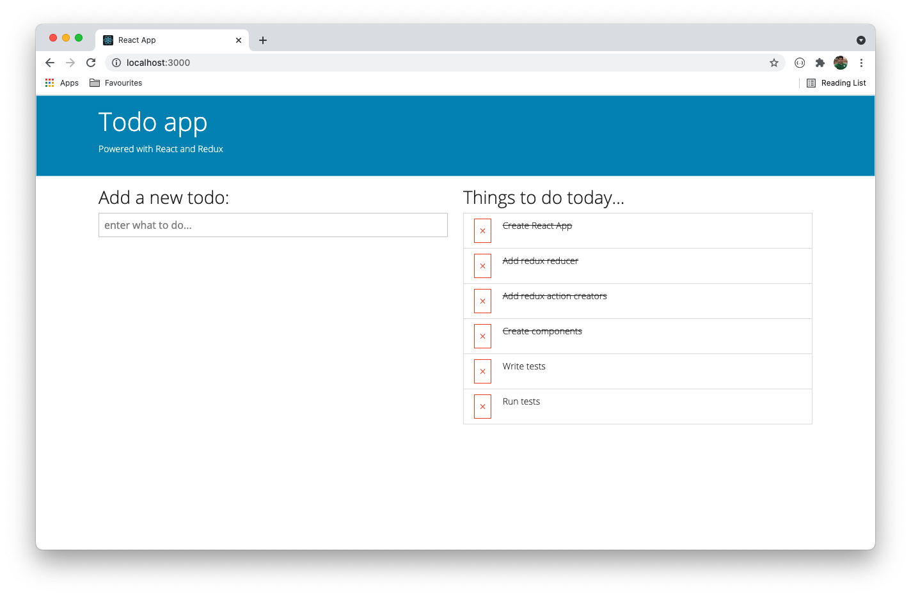
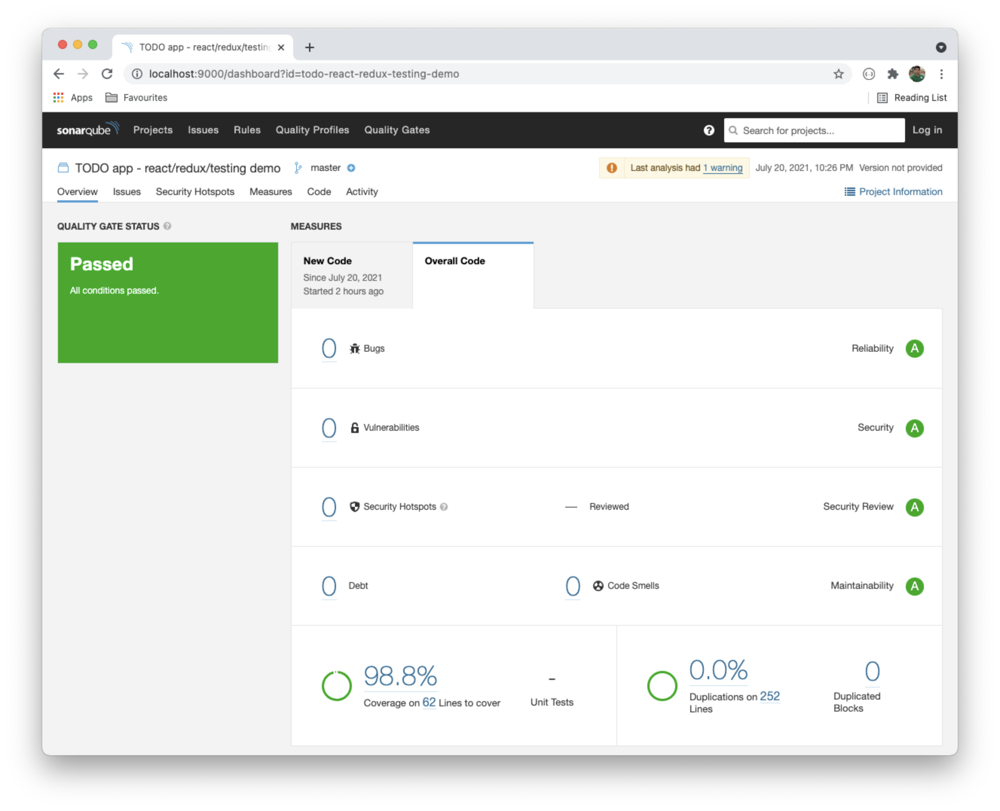

# TODO app - react/redux/testing demo

-   Clone the repository
    -   `git clone https://github.com/kayartaya-vinod/todo-react-redux-testing-demo.git`
-   Install dependencies
    -   `npm i`
-   Run the app
    -   `npm start`
-   Run the tests
    -   `npm test`
-   Publish to sonarqube
    -   `npm run sonar`

